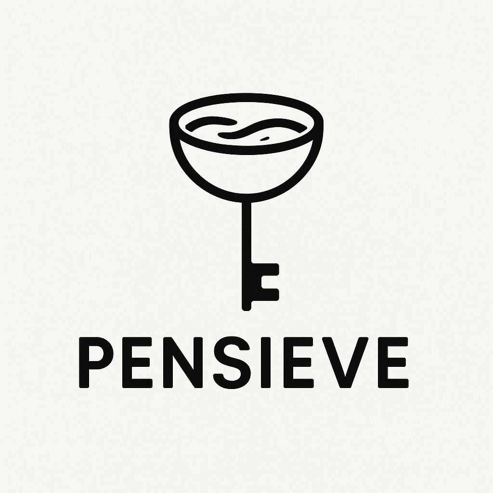

<p align="center">

</p>

**Pensieve** is a durable, in-memory key–value store written in Rust. It uses an LRU (Least Recently Used) cache for eviction and exposes a HTTP REST API via the [Axum](https://crates.io/crates/axum). The name _Pensieve_ comes from one of the most fascinating magical objects in the [Wizarding World](https://www.harrypotter.com/writing-by-jk-rowling/pensieve)


 ## Table of Contents
 - [Overview](#overview)
 - [Features](#features)
 - [Getting Started](#getting-started)
   - [Prerequisites](#prerequisites)
   - [Installation](#installation)
   - [Building](#building)
   - [Running](#running)
 - [Configuration](#configuration)
 - [API Reference](#api-reference)
   - [GET /get/{key}](#get-getkey)
   - [POST /put](#post-put)
   - [DELETE /delete/{key}](#delete-deletekey)
 - [Project Structure](#project-structure)
 - [Error Handling](#error-handling)
 - [Logging](#logging)
 - [Contributing](#contributing)
 - [License](#license)
 - [Acknowledgments](#acknowledgments)

 ## Overview
Pensieve provides a lightweight, durable, thread-safe REST API for storing, retrieving, and deleting string values by key. Internally, it maintains a capacity-limited LRU cache so that the most-recently-accessed keys stay in memory, while old entries are evicted when capacity is reached.

 ## Features
 - HTTP API
 - LRU eviction policy (configurable capacity)
 - Append-only logs for durability
 - Thread-safe via `Arc<Mutex<...>>`
 - Built with [Tokio](https://crates.io/crates/tokio) and [Axum](https://crates.io/crates/axum)

 ## Getting Started

 ### Prerequisites
 - Rust (1.65+ recommended)
 - Cargo (comes with Rust)


 ### Building
 ```bash
 cargo build --release
 ```

 ### Running
 By default, the server listens on `0.0.0.0:7878`:
 ```bash
 cargo run --release
 ```

 ## Configuration
 The cache capacity is currently hard-coded to `1000` entries in `src/main.rs`:
 ```rust
 let store = Store::new(1000);
 ```
 To change the capacity, edit that value or extend the code to accept a CLI flag or environment variable.

 ## API Reference

 All endpoints use `application/json` for requests and responses.

 ### GET /get/{key}
 Retrieve the value associated with a key.

 Request:
 ```http
 GET /get/foo HTTP/1.1
 Host: localhost:7878
 ```

 Example with `curl`:
 ```bash
 curl http://localhost:7878/get/foo
 ```

 Response (key exists):
 ```json
 { "val": "bar" }
 ```

 Response (key missing):
 ```json
 { "val": "" }
 ```

 ### POST /put
 Store or update a key–value pair.

 Request (JSON body):
 ```json
 { "key": "foo", "val": "bar" }
 ```

 Example with `curl`:
 ```bash
 curl -X POST http://localhost:7878/put \
      -H "Content-Type: application/json" \
      -d '{ "key": "foo", "val": "bar" }'
 ```

 Response:
 ```json
 { "status": "ok" }
 ```

 ### DELETE /delete/{key}
 Remove a key from the store.

 Request:
 ```http
 DELETE /delete/foo HTTP/1.1
 Host: localhost:7878
 ```

 Example with `curl`:
 ```bash
 curl -X DELETE http://localhost:7878/delete/foo
 ```

 Response:
 ```json
 { "status": "ok" }
 ```

 ## Project Structure
 ```text
 pensieve/
 ├── Cargo.toml            # Project metadata & dependencies
 ├── LICENSE               # MIT License
 ├── README.md             # This file
 └── src/
     ├── main.rs           # HTTP server, routing & state
     └── store.rs          # LRU-backed key–value store
 ```


 ## Contributing
 Contributions, bug reports, and feature requests are welcome! Please:
 1. Fork the repository
 2. Create a feature branch (`git checkout -b feature/...`)
 3. Commit your changes and open a pull request

 ## License
 This project is licensed under the MIT License. See the [LICENSE](LICENSE) file for details.

 ## Acknowledgments
 - [Axum](https://crates.io/crates/axum)
 - [Tokio](https://crates.io/crates/tokio)
 - [lru](https://crates.io/crates/lru)
 - [Serde](https://crates.io/crates/serde) & [Serde JSON](https://crates.io/crates/serde_json)
